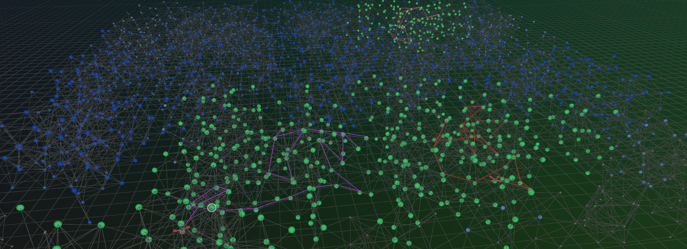

# Graph Exploration & Surveillance Challenge

<p align="center">
  
</p>

**Three UAVs** explore an unknown 3D graph from one centralized policy. Sensor
view is depth-limited along connectivity — no seeing through walls.

**Goal:** finish **explore** then **surveil** with the lowest makespan flight
distance (slowest UAV sets the score).

**Documentation:** [`docs/RULES.md`](docs/RULES.md) (full rulebook),
[`docs/graph_format.md`](docs/graph_format.md) (graph JSON schema),
[`docs/results_format.md`](docs/results_format.md) (eval JSON export).

## Quick start

### With uv (recommended)

[uv](https://docs.astral.sh/uv/) sets up everything in one command: it reads
`pyproject.toml`, creates the environment, and installs dependencies. Nothing
to activate.

First install uv once (see the
[official guide](https://docs.astral.sh/uv/getting-started/installation/)):

```bash
# macOS / Linux:
curl -LsSf https://astral.sh/uv/install.sh | sh
# Windows (PowerShell):
#   powershell -c "irm https://astral.sh/uv/install.ps1 | iex"
# ...or: pipx install uv  /  pip install uv  /  brew install uv
```

Restart your shell (or `source $HOME/.local/bin/env`) so `uv` is on your PATH,
then:

```bash
# Run the random-walk baseline on the training graphs (env is built automatically):
uv run run_eval.py --graphs graphs/train

# With the Rerun 3D visualizer (--viz-reduced for a lighter static-map mode;
# install the viz extra first: uv sync --extra viz):
uv run run_eval.py --graphs graphs/train --viz

# Evaluate your own submission (3 UAVs by default; seed count from params.toml):
uv run run_eval.py --submission my_solution.py --graphs graphs/train

# Batch eval with a progress bar (suppress per-step output):
uv run run_eval.py --graphs graphs/train --quiet
```

### With pip

```bash
pip install -e .

python run_eval.py --graphs graphs/train            # 3-UAV baseline (default)
python run_eval.py --graphs graphs/train --viz      # 3D visualizer (--viz-reduced for static-map mode)
python run_eval.py --submission my_solution.py --graphs graphs/train
```

## Writing a submission

Copy [`exploration_challenge/policies/random_walk.py`](exploration_challenge/policies/random_walk.py),
implement `reset` / `step`, and pass `--submission my_solution.py` to
`run_eval.py`. Full API, constraints, and hand-in steps:
[`docs/RULES.md`](docs/RULES.md).

```python
class Explorer:
    def reset(self, starts, observations, seed=None): ...
    def step(self, observations, phase):
        # return three int next-hop node ids (one per UAV)
        ...
```

## How it works

```
graph JSON (graphs/train/) ──> Simulator (true graph)
                        │  depth-k restricted view
                        ▼
                   Observation ──> Explorer.step ──> next-hop actions
                        │                                │
                        └──────── validates one hop ─────┘
                        │
                   coverage + phase tracking ──> evaluator ──> score
                                                       └─> Rerun viz
```

Mechanics and scoring: [`docs/RULES.md`](docs/RULES.md). Terminal summary and
`--output` JSON: [`docs/results_format.md`](docs/results_format.md).

## Configuration

Defaults live in `exploration_challenge/params.toml` (`[eval]`); override most
via `run_eval.py` CLI flags (`--seeds`, `--k`, `--n-agents`, `--submission`,
etc.). Training graphs: `graphs/train/`.

Optional visualizer: `uv sync --extra viz` (or `pip install -e ".[viz]"`), then
`--viz` or `--viz-reduced`.

## Layout

```
run_eval.py              # CLI entry point
docs/                    # RULES.md, graph_format.md, results_format.md
graphs/train/            # training graphs
results/                 # eval output from --output
exploration_challenge/
  params.toml            # evaluation defaults ([eval])
  graph_io.py            # node-link JSON load/save + graph helpers
  observation.py         # depth-k restricted view
  simulator.py           # world state, movement, phases, coverage
  evaluator.py           # run episodes, scoring, live stats
  viz/                   # Rerun 3D view (core, mesh, styles, rerun_compat)
  policies/
    random_walk.py       # starter baseline + default eval policy
  _internal/             # config, progress, seeding, sensor
```
